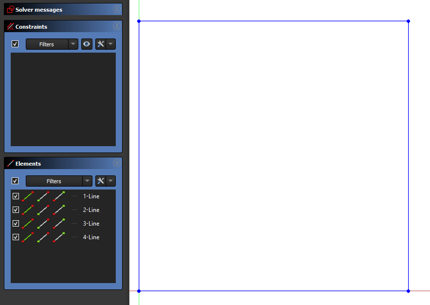
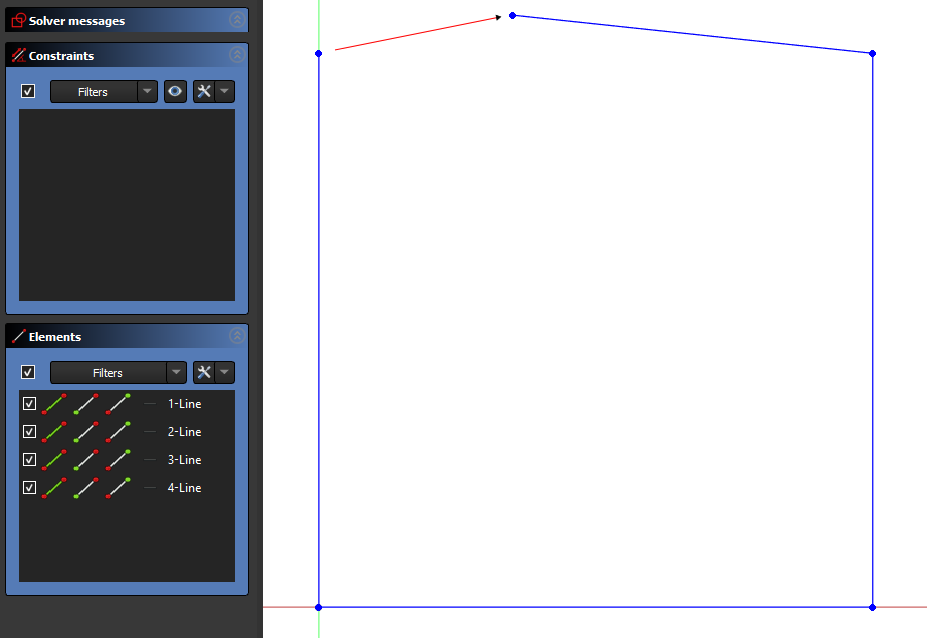
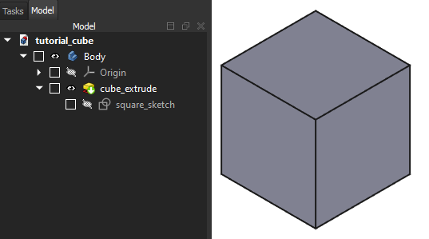

Usage
=====

Installation
------------

.. note::
    
    This project is under active development. and has not been placed into the 
    Python Package Index yet.

To use PanCAD, first install it using pip:

.. code-block:: console

   (.venv) $ pip install PanCAD

Getting Started Tutorials
-------------------------

How do I read from a FreeCAD file?
^^^^^^^^^^^^^^^^^^^^^^^^^^^^^^^^^^

A FreeCAD file can be read into a :class:`~PanCAD.filetypes.PartFile` like this:

.. literalinclude:: tutorials/how_to_read_from_a_freecad_file.py
    :linenos:
    :lines: 1,2,3

The contents of the file can be summarized by using print on the PartFile:

.. literalinclude:: tutorials/how_to_read_from_a_freecad_file.py
    :linenos:
    :lines: 4
    :lineno-match:

The PartFile will have a tabular summary output to the command line:

.. program-output:: cd tutorials && python how_to_read_from_a_freecad_file.py
    :shell:

How do I make a FreeCAD file?
^^^^^^^^^^^^^^^^^^^^^^^^^^^^^

A :class:`~PanCAD.filetypes.PartFile` can generate a FreeCAD file, allowing CAD 
to be finely version controlled.

Let's make a 1 mm cube as a first step. We'll start by defining the corners of 
the a square as tuples:

.. literalinclude:: tutorials/how_do_i_make_a_freecad_file.py
    :start-after: [corner-definition-start]
    :end-before: [corner-definition-end]

With the corner points defined, we can create 
4 :class:`~PanCAD.geometry.LineSegment` elements to act as the bottom, right,
top and left sides of a square CAD sketch. We'll constrain them into place later.
The line segments can be created like this:

.. note::
    Pay attention to the order of the first and second corner arguments! The 
    'start' and 'end' points of a line segment will matter when we return to 
    fully define the sketch.

.. literalinclude:: tutorials/how_do_i_make_a_freecad_file.py
    :start-after: [line-definition-start]
    :end-before: [line-definition-end]

Now that we have our square's line segments, they need to be put into 
a :class:`~PanCAD.geometry.Sketch` element. We'll also name the sketch using the 
'name' keyword argument:

.. literalinclude:: tutorials/how_do_i_make_a_freecad_file.py
    :start-after: [sketch-definition-start]
    :end-before: [sketch-definition-end]

If we were to send save this sketch to FreeCAD now, the lines in the sketch 
would be 'unconstrained'. The line end points would not be rigidly connected and 
they would be able to rotate freely.

Below is the sketch as generated on the left and after clicking and dragging the 
top left corner on the right, note that the unconstrained lines are shown in 
blue:

FreeCAD and most CAD software won't be able to tell that this is an 
extrusion-ready square that without additional constraints placed on the 
lines. There are dozens of ways that even just these 4 lines can be constrained 
to make a square, but we have to pick one so we'll just choose to constrain:

1. The end points to each other.
2. The orientations of the lines to vertical or horizontal
3. The distances between the top/bottom and left/right pairs of lines.
4. The bottom left corner to the sketch's origin point.

We'll need the :func:`~PanCAD.geometry.constraints.make_constraint` method
and a PanCAD enumeration called
a :class:`~PanCAD.geometry.constants.ConstraintReference` to fully 
constrain the lines using the strategy above. ConstraintReferences tell PanCAD 
which part of the geometry you want to constrain, such as 'the end point of 
this line segment' (equivalent to
:class:`~PanCAD.geometry.constants.ConstraintReference.END`\) or 'the line of 
this line segment' (equivalent to 
:class:`~PanCAD.geometry.constants.ConstraintReference.CORE`\ ). We'll also need 
to add in the side length we defined earlier and define its unit as millimeters.

.. literalinclude:: tutorials/how_do_i_make_a_freecad_file.py
    :start-after: [constraint-definition-start]
    :end-before: [constraint-definition-end]

The sketch constraints were the hard part, so now all that's left is to extrude 
the sketch to finish off the cube. We'll do this by making a PanCAD 
:class:`~PanCAD.geometry.Extrude` using its 
:meth:`~PanCAD.geometry.Extrude.from_length` method. Using from_length's default 
arguments will extrude the sketch directly from the plane it's defined on.

.. literalinclude:: tutorials/how_do_i_make_a_freecad_file.py
    :start-after: [extrude-definition-start]
    :end-before: [extrude-definition-end]

The cube CAD's done! Now to add the sketch and extrude to a 
:class:`~PanCAD.filetypes.PartFile` by setting its
:attr:`~PanCAD.filetypes.PartFile.features` property to the list of features.
We can save it to FreeCAD using :meth:`~PanCAD.filetypes.PartFile.to_freecad`\ .
Make sure to add the sketch before the extrude, since the extrude depends on the 
sketch. You should find the FreeCAD '.FCStd' file in the same directory that you 
ran the script in.

.. literalinclude:: tutorials/how_do_i_make_a_freecad_file.py
    :start-after: [file-definition-start]
    :end-before: [file-definition-end]

.. note::
    When you open the FreeCAD file after initially generating it, you'll find 
    that the geometry doesn't appear in the window. Don't worry, it's there 
    but invisible! (no, really)
    
    The PanCAD-to-FreeCAD interface does not yet support initializing the 
    visualization of the model, so you need to go into Model tab and click 
    the eye symbols next to the pad and body features to see the geometry.

Here's what you should get when you open the file in FreeCAD:

